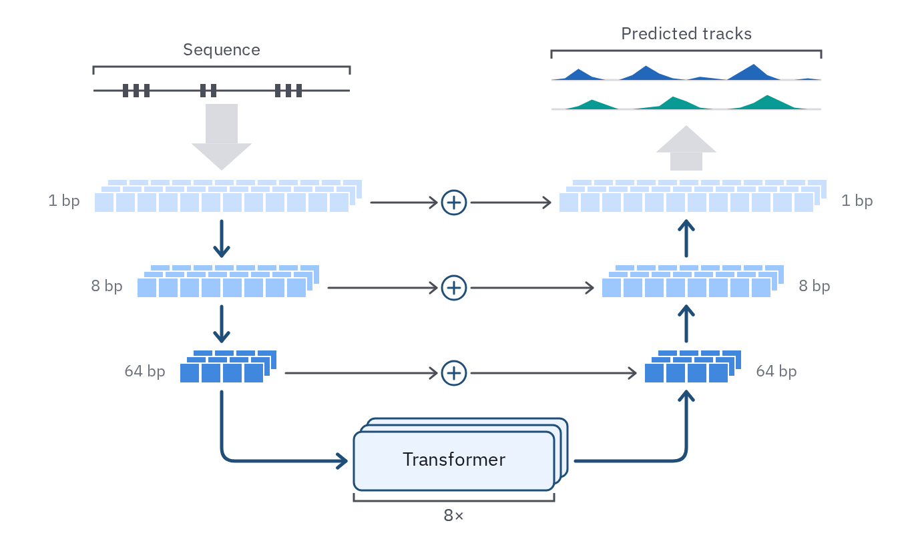
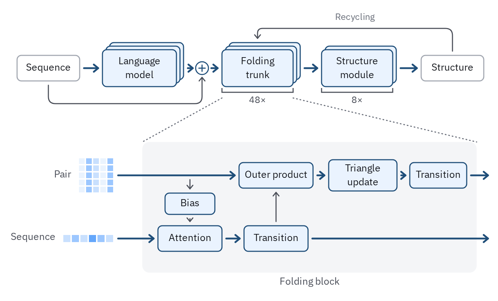

# 27 · Architecture diagram

For a model's structure: the modules it is built from, the shape of what passes
between them, and the path the data take from input to output. It shows the
structure a reader needs to follow the paper; the layer count and widths go in the
Methods.

- **Input at the top, output at the end of the path.** Data enter in their own form
  (a sequence, a record's tracks) and leave as what the model predicts, drawn the same
  way (*Schematics*, `../../illustration.md`), so the diagram starts and ends on things
  the reader knows.
- **Learned modules are blocks** in the model role: `blue-100` fill, 1.5 px
  `prussian` outline, a 6 px radius and a short name ("Transformer"). Fixed steps
  (pooling, a sum) are `wash` with no outline. Name a module by what readers know;
  the algorithm goes in the name only when it is the point.
- **What passes between modules is cells**: a row of square cells with 2 px paper
  gaps, its length for the sequence length and a stack behind it (5 px up and right
  per copy) for channels. Resolution steps take steps of one ramp, light at full
  resolution and darker as it coarsens, so depth reads without a label.
- **Repeats are brackets, not copies.** Stack at most three copies of a block (depth)
  to say "many"; give the count with a 1.5 px `ink-2` bracket and its label ("8×").
- **One path, one weight.** The path the data take is the 2.5 px `prussian` wire
  with an open chevron; side paths (skip connections, conditioning) are 1.5 px
  `ink-2`. A sum or product where paths meet is an operator node: a paper disc,
  r 9, 1.5 px `prussian`, with + or ×.
- **A flow band** (a 24 px `rule` band with a broad head, under everything) carries
  the data into the model and out of it, so the overview path stays legible beside
  the wires inside.
- **Labels sit beside the part they name**, in `label` at 14 px; shapes and sizes
  (resolution, length) in `tick` at 12 px, `muted`. A diagram has no title inside it.



```js figure=main w=680 h=412
const S = GA.schematic(ga);
const ramp3 = ramp("blue", [200, 300, 500]);
const E = 166, D = 514, M = 340, C = 16; // encoder, decoder and skip columns; cell size
// input: a sequence with its gene marks; output: predicted coverage tracks
S.bracket({ x0: E - 96, x1: E + 96, y: 50, side: "top", label: "Sequence" });
ga.raw(`<path d="M${E - 96} 68H${E + 96}" stroke="var(--ink-2)" stroke-width="1.5"/>` +
  [-74, -66, -58, -16, -8, 40, 48, 56].map((x) => `<rect x="${E + x}" y="63" width="4" height="10" fill="var(--ink-2)"/>`).join(""));
S.tracks({ x: D - 101, y: 44, w: 202, pitch: 22, rows: [
  { kind: "signal", color: "var(--cat-1)", data: [0, .1, .7, .2, 0, 0, .3, .9, .4, .1, 0, .2, .1, 0, .5, 1, .3, 0, 0, .1, 0] },
  { kind: "signal", color: "var(--cat-3)", data: [0, 0, .2, .6, .3, 0, 0, .1, .2, .8, .5, .1, 0, 0, .1, .4, .9, .5, .1, 0, 0] },
] });
S.bracket({ x0: D - 101, x1: D + 101, y: 38, side: "top", label: "Predicted tracks" });
// encoder (left) and decoder (right): three resolutions, coarser going down
const lv = [{ n: 12, y: 144 }, { n: 8, y: 208 }, { n: 4, y: 272 }];
const enc = lv.map((l, i) => S.cells({ x: E - (l.n * C) / 2, y: l.y, n: l.n, cell: C, depth: 3, fill: ramp3[i] }));
const dec = lv.map((l, i) => S.cells({ x: D - (l.n * C) / 2, y: l.y, n: l.n, cell: C, depth: 3, fill: ramp3[i] }));
["1 bp", "8 bp", "64 bp"].forEach((t, i) => {
  const y = enc[i].face.cy - 7;
  ga.text(t, { x: enc[i].face.x0 - 10, y, role: "tick", size: 12, color: "var(--muted)", anchor: "end" });
  ga.text(t, { x: dec[i].r + 10, y, role: "tick", size: 12, color: "var(--muted)" });
});
// the transformer at the bottom of the U, repeated eight times
const tf = S.block({ x: M - 75, y: 324, w: 150, h: 44, label: "Transformer", depth: 3 });
S.bracket({ x0: M - 75, x1: M + 75, y: 376, side: "bottom", label: "8×" });
// the path: in, down the encoder, through the transformer, up the decoder, out
S.flow([{ x: E, y: 78 }, { x: E, y: 128 }]);
S.flow([{ x: D, y: 128 }, { x: D, y: 94 }]);
S.wire([S.port(enc[0], "b"), { x: E, y: enc[1].t - 6 }]);
S.wire([S.port(enc[1], "b"), { x: E, y: enc[2].t - 6 }]);
S.wire([S.port(enc[2], "b"), { x: E, y: tf.face.cy }, S.port(tf, "l")], { to: tf });
S.wire([{ x: tf.r + 6, y: tf.face.cy }, { x: D, y: tf.face.cy }, S.port(dec[2], "b")], { from: tf });
S.wire([{ x: D, y: dec[2].t - 6 }, S.port(dec[1], "b")]);
S.wire([{ x: D, y: dec[1].t - 6 }, S.port(dec[0], "b")]);
// skip connections: each encoder level summed into the decoder level opposite
enc.forEach((e, i) => {
  const y = e.face.cy, o = S.op({ cx: M, cy: y, sym: "+" });
  S.wire([{ x: e.r + 6, y }, { x: M - 13, y }], { tone: "minor", to: o });
  S.wire([{ x: M + 13, y }, S.port(dec[i], "l")], { tone: "minor", from: o });
});
```

## A block opened

For a model whose repeated block is the point: the stages in a row on top, and one
block opened beneath it, as a zoom.

- **The stages in a row**, each a model block stacked to say "many", its count on
  a bracket beneath ("48×"). Inputs that join (a language model's embedding and the
  sequence itself) meet at an operator node. A loop over the stages (recycling) is a
  1.5 px `ink-2` wire over the top, named once.
- **The opened block is a panel**: `wash`, 10 px radius, its name under it in
  `label`. Dotted leaders run from the stage it opens to the panel's top corners
  (`../../illustration.md`, *Zoom*).
- **Inside, one lane per representation**, each entering from the left in its own
  shape (a grid for pairs, cells for the sequence) and leaving at the right. Sub-layers
  are model blocks on their lane; what crosses between lanes is a 1.5 px wire.



```js figure=a-block-opened w=700 h=424
const S = GA.schematic(ga);
// the stages
const seq = S.block({ x: 24, y: 78, w: 88, h: 36, role: "data", label: "Sequence" });
const lm = S.block({ x: 144, y: 70, w: 104, h: 52, label: "Language\nmodel", depth: 3 });
const sum = S.op({ cx: 284, cy: 96, sym: "+" });
const trunk = S.block({ x: 312, y: 70, w: 100, h: 52, label: "Folding\ntrunk", depth: 3 });
const sm = S.block({ x: 452, y: 70, w: 100, h: 52, label: "Structure\nmodule", depth: 2 });
const out = S.block({ x: 592, y: 78, w: 88, h: 36, role: "data", label: "Structure" });
S.bracket({ x0: 312, x1: 412, y: 130, side: "bottom", label: "48×" });
S.bracket({ x0: 452, x1: 552, y: 130, side: "bottom", label: "8×" });
S.wire([S.port(seq, "r"), S.port(lm, "l")], { from: seq, to: lm });
S.wire([{ x: lm.r + 6, y: 96 }, { x: 271, y: 96 }], { from: lm, to: sum });
S.wire([{ x: 297, y: 96 }, S.port(trunk, "l")], { from: sum, to: trunk });
S.wire([{ x: trunk.r + 6, y: 96 }, S.port(sm, "l")], { from: trunk, to: sm });
S.wire([{ x: sm.r + 6, y: 96 }, S.port(out, "l")], { from: sm, to: out });
S.wire([S.port(seq, "b"), { x: 68, y: 146 }, { x: 284, y: 146 }, { x: 284, y: 109 }], { tone: "minor", from: seq, to: sum });
S.wire([S.port(out, "t"), { x: 636, y: 40 }, { x: 362, y: 40 }, { x: 362, y: trunk.t - 6 }], { tone: "minor", from: out, to: trunk });
ga.text("Recycling", { x: 499, y: 18, role: "note", size: 13, anchor: "middle" });
// one folding block, opened
const P = S.panel({ x: 200, y: 200, w: 470, h: 184, label: "Folding block" });
ga.raw(`<path d="M312 138L${P.l} ${P.t}M412 138L${P.r} ${P.t}" stroke="var(--muted)" stroke-width="1.5" stroke-dasharray="1 4" stroke-linecap="round"/>`);
const pair = S.grid({ x: 110, y: 222, rows: 5, cols: 5, fill: (i, j) => tok(`blue-${[100, 200, 300][(i * 3 + j * 2) % 3]}`) });
const res = S.cells({ x: 88, y: 330, n: 6, cell: 12, fill: (i) => tok(`blue-${[200, 300, 200, 400, 300, 200][i]}`) });
ga.text("Pair", { x: 100, y: 239, anchor: "end", role: "label", size: 14, color: "var(--ink-2)" });
ga.text("Sequence", { x: 78, y: 327, anchor: "end", role: "label", size: 14, color: "var(--ink-2)" });
const prod = S.block({ x: 336, y: 229, w: 104, h: 36, label: "Outer product" });
const tri = S.block({ x: 462, y: 225, w: 96, h: 44, label: "Triangle\nupdate" });
const ptr = S.block({ x: 576, y: 229, w: 80, h: 36, label: "Transition" });
const bias = S.block({ x: 232, y: 272, w: 70, h: 30, label: "Bias" });
const att = S.block({ x: 222, y: 318, w: 90, h: 36, label: "Attention" });
const str = S.block({ x: 343, y: 318, w: 90, h: 36, label: "Transition" });
// the pair lane
S.wire([S.port(pair, "r"), S.port(prod, "l")], { from: pair, to: prod });
S.wire([S.port(prod, "r"), S.port(tri, "l")], { from: prod, to: tri });
S.wire([S.port(tri, "r"), S.port(ptr, "l")], { from: tri, to: ptr });
S.wire([S.port(ptr, "r"), { x: 686, y: 247 }], { from: ptr });
// the sequence lane, biased by the pairs, feeding back into them
S.wire([S.port(res, "r"), S.port(att, "l")], { from: res, to: att });
S.wire([S.port(att, "r"), S.port(str, "l")], { from: att, to: str });
S.wire([S.port(str, "r"), { x: 686, y: 336 }], { from: str });
S.wire([{ x: 267, y: 253 }, S.port(bias, "t")], { tone: "minor", to: bias });
S.wire([S.port(bias, "b"), S.port(att, "t", 45 / 90)], { tone: "minor", from: bias, to: att });
S.wire([S.port(str, "t"), S.port(prod, "b", 52 / 104)], { tone: "minor", from: str, to: prod });
```

## In each format

| Element | Canvas | Print |
|---|---|---|
| Block | 1.5 px outline, 6 px radius, 14 px label | 0.5 pt, 0.6 mm radius, 6–7 pt |
| Cell | 16 px, 2 px paper gap | 1.6–2 mm, 0.5 pt gap |
| Main wire / side wire | 2.5 px / 1.5 px | 1 pt / 0.5 pt |
| Flow band | 24 px | 2.5 mm |
