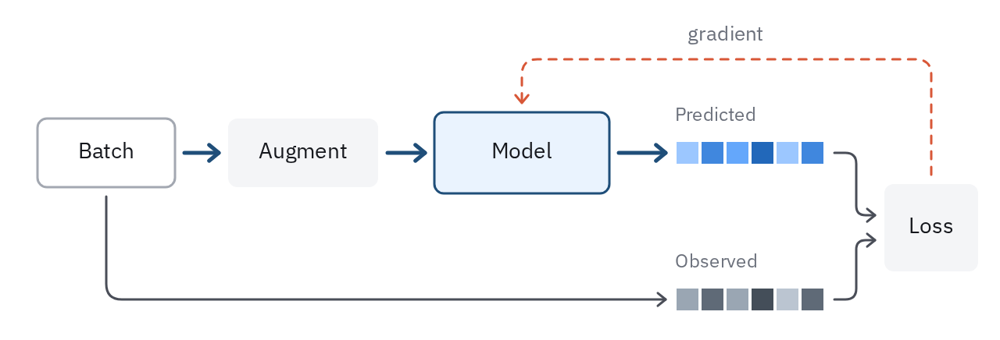
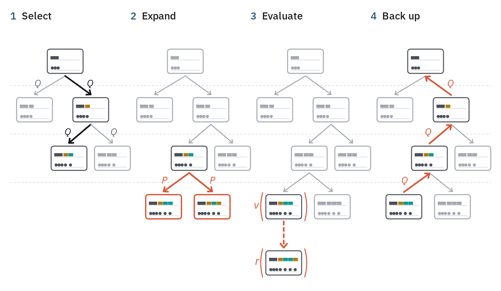

# 28 · Procedure schematic

For a method's steps: training, inference, a search, an analysis pipeline. Each step
is a block or a small drawing, and the wires between them say what is passed on.
It reads left to right, or top to bottom when the steps are tall.

- **Steps are blocks in their role**: a learned model is a model block, a fixed step
  (augment, sample, score) an op block, and what is handed on is data, drawn as data
  (cells, tracks; *Schematics*, `../../illustration.md`). Name each step with a verb
  or a noun the reader knows, one or two words.
- **The forward path is the main wire**, 2.5 px `prussian`. **What feeds back** (a
  gradient, an update, a target) is a 1.5 px `accent` wire, dashed, routed around the
  forward path, above it where there is room, with square corners rounded at 10 px, and named once in `muted`
  beside it ("gradient").
- **Two things compared** (predicted against observed, a policy against the
  clinician) sit one above the other in the same shape, so the comparison is the
  gap between them; predicted takes the model's blue, observed `ink-2`.
- **A loop is drawn once.** Show one pass and let the feedback wire close it. To say
  "repeated over many", stack the block (depth 2–3) or add a bracket with the count.



```js figure=main w=640 h=218
const S = GA.schematic(ga);
const batch = S.block({ x: 24, y: 76, w: 88, h: 44, role: "data", label: "Batch" });
const aug = S.block({ x: 146, y: 76, w: 96, h: 44, role: "op", label: "Augment" });
const model = S.block({ x: 278, y: 72, w: 112, h: 52, role: "model", label: "Model" });
const pred = S.cells({ x: 432, y: 90, n: 6, cell: 16, fill: (i) => tok(`blue-${[300, 500, 400, 600, 300, 500][i]}`) });
const obs = S.cells({ x: 432, y: 184, n: 6, cell: 16, fill: (i) => tok(`slate-${[400, 600, 400, 700, 300, 600][i]}`) });
ga.text("Predicted", { x: 432, y: 68, role: "tick", size: 12, color: "var(--muted)" });
ga.text("Observed", { x: 432, y: 162, role: "tick", size: 12, color: "var(--muted)" });
const loss = S.block({ x: 566, y: 118, w: 60, h: 56, role: "op", label: "Loss" });
// the forward path
S.wire([S.port(batch, "r"), S.port(aug, "l")], { from: batch, to: aug });
S.wire([S.port(aug, "r"), S.port(model, "l")], { from: aug, to: model });
S.wire([S.port(model, "r"), S.port(pred, "l")], { from: model, to: pred });
S.wire([S.port(pred, "r"), { x: 548, y: 98 }, { x: 548, y: 138 }, S.port(loss, "l", 20 / 56)], { tone: "minor", from: pred, to: loss });
// the observed values go round the model, straight to the comparison
S.wire([S.port(batch, "b"), { x: 68, y: 192 }, S.port(obs, "l")], { tone: "minor", from: batch, to: obs });
S.wire([S.port(obs, "r"), { x: 548, y: 192 }, { x: 548, y: 154 }, S.port(loss, "l", 36 / 56)], { tone: "minor", from: obs, to: loss });
// the gradient, fed back outside the forward path
S.wire([S.port(loss, "t"), { x: 596, y: 38 }, { x: 334, y: 38 }, S.port(model, "t")], { tone: "minor", color: "var(--accent)", dash: true, from: loss, to: model });
ga.text("gradient", { x: 440, y: 16, role: "note", size: 13 });
```

## Steps in a row

For a procedure whose steps act on one object (a search tree, a cohort, a record):
draw the object once per step, in a row of columns, each state as a small cartoon of
the thing itself, and ink only what that step touches.

- Each column opens with the step's number in `prussian` and its name in `ink`,
  both 500 (`S.step`). The columns share a top line and a width.
- **A state is a cartoon, not a dot.** Draw the object at each node small, the way
  the paper's reader knows it: a patient's record as a card of mini tracks, a board
  as a board. A child is its parent with the action added, in that action's colour (identity slots, not blue, which is the model's),
  so the tree reads as histories branching.
- **The same tree in every column, in the same place**, depth levels on dashed
  `rule` guides across the figure. What the step acts on is `ink`: states with an
  `ink-2` outline and their colours, edges 2.5 px with a head. The rest is
  `context`: grey cards, 1.5 px edges.
- **What a step adds is `accent`**: new states outlined in it, a rollout as a
  dashed 2.5 px arrow, the value running back up the path. Values are written as the
  paper writes them, a function of the state, *v*( ) and *r*( ) (`S.fn`), and edge
  quantities (*Q*, *P*) sit beside their edge in `math`, `ink` on the chosen edge
  and `muted` on the others.



```js figure=steps-in-a-row w=784 h=456
const S = GA.schematic(ga);
const INK = "var(--ink)", CTX = "var(--context)", PRU = "var(--accent)", MUT = "var(--muted)";
// a state is the record so far: earlier therapy, then one interval per action (a, b)
const ACT = { a: "var(--cat-3)", b: "var(--cat-2)" };
const record = (acts) => [
  { kind: "spans", data: [[0, 0.28, "var(--ink-2)"], ...acts.map((c, k) => [0.3 + 0.17 * k + 0.01, 0.3 + 0.17 * (k + 1), ACT[c]])] },
  { kind: "events", data: [0.06, 0.16, 0.26, ...acts.map((_, k) => 0.38 + 0.17 * k)] },
];
const HIST = { R: "", A: "a", B: "b", C: "ba", D: "bb", E: "baa", F: "bab", T: "baab" };
const KIDS = { R: ["A", "B"], B: ["C", "D"], C: ["E", "F"] };
const at = (x0) => ({ R: [x0 + 86, 96], A: [x0 + 38, 172], B: [x0 + 126, 172], C: [x0 + 92, 248], D: [x0 + 160, 248], E: [x0 + 52, 324], F: [x0 + 128, 324], T: [x0 + 52, 412] });
// per step: tone of each state, inked edges, edges a step adds, the edge label
const STEPS = [
  { name: "Select", nodes: "RABCD", ink: "RBC", add: "", edges: ["R-B", "B-C"], label: "Q" },
  { name: "Expand", nodes: "RABCDEF", ink: "C", add: "EF", edges: [], newEdges: ["C-E", "C-F"], label: "P" },
  { name: "Evaluate", nodes: "RABCDEFT", ink: "ET", add: "", edges: [] },
  { name: "Back up", nodes: "RABCDEF", ink: "RBCE", add: "", edges: [], up: ["E-C", "C-B", "B-R"] },
];
// depth guides, across every column
ga.raw([134, 210, 286].map((y) => `<path d="M16 ${y}H768" stroke="var(--rule)" stroke-width="1" stroke-dasharray="3 3"/>`).join(""));
const H = 19; // half a card's height
const edgeLabel = (p, q, str, color) => {
  const mx = (p[0] + q[0]) / 2, my = (p[1] + q[1]) / 2, right = q[0] >= p[0];
  ga.text(`*${str}*`, { x: mx + (right ? 14 : -14), y: my - 10, anchor: right ? "start" : "end", role: "math", size: 15, color });
};
STEPS.forEach((st, i) => {
  const x0 = 16 + i * 188, P = at(x0);
  S.step(i + 1, st.name, { x: x0, y: 18 });
  for (const [p, kids] of Object.entries(KIDS))
    for (const q of kids) {
      if (!st.nodes.includes(q)) continue;
      const key = `${p}-${q}`, on = st.edges.includes(key), add = (st.newEdges || []).includes(key);
      if ((st.up || []).includes(`${q}-${p}`)) continue; // drawn as the update below
      const color = on ? INK : add ? PRU : CTX;
      S.wire([{ x: P[p][0], y: P[p][1] + H + 4 }, { x: P[q][0], y: P[q][1] - H - 5 }], { color, width: on || add ? 2.5 : 1.5, headSize: on || add ? 7 : 5.5 });
      if (st.label && (p === "R" || p === "B" ? i === 0 : i === 1) && kids.length) edgeLabel(P[p], P[q], st.label, on ? INK : add ? PRU : MUT);
    }
  const card = {};
  for (const k of st.nodes) card[k] = S.state({ cx: P[k][0], cy: P[k][1], w: 56, rows: record(HIST[k].split("").filter(Boolean)), tone: st.add.includes(k) ? "add" : st.ink.includes(k) ? "ink" : "context" });
  if (i === 2) {
    S.wire([{ x: P.E[0], y: P.E[1] + H + 4 }, { x: P.T[0], y: P.T[1] - H - 5 }], { color: PRU, width: 2.5, dash: true });
    S.fn(card.E, "v", { color: PRU });
    S.fn(card.T, "r", { color: PRU });
  }
  if (i === 3)
    for (const key of st.up) {
      const [p, q] = key.split("-");
      S.wire([{ x: P[p][0], y: P[p][1] - H - 4 }, { x: P[q][0], y: P[q][1] + H + 5 }], { color: PRU, width: 2.5, headSize: 7 });
      edgeLabel(P[q], P[p], "Q", PRU);
    }
});
```

## In each format

| Element | Canvas | Print |
|---|---|---|
| Block | 1.5 px outline, 6 px radius, 14 px label | 0.5 pt, 0.6 mm radius, 6–7 pt |
| Forward wire / feedback wire | 2.5 px / 1.5 px, `5 5` dash | 1 pt / 0.5 pt, `2 2` dash |
| Step number and name | 16 px, 500 | 7 pt, 500 (the panel's own letter stays the panel letter) |
| State card | 56 × 38 px, 1.5 px outline | 12 × 8 mm, 0.5 pt |
