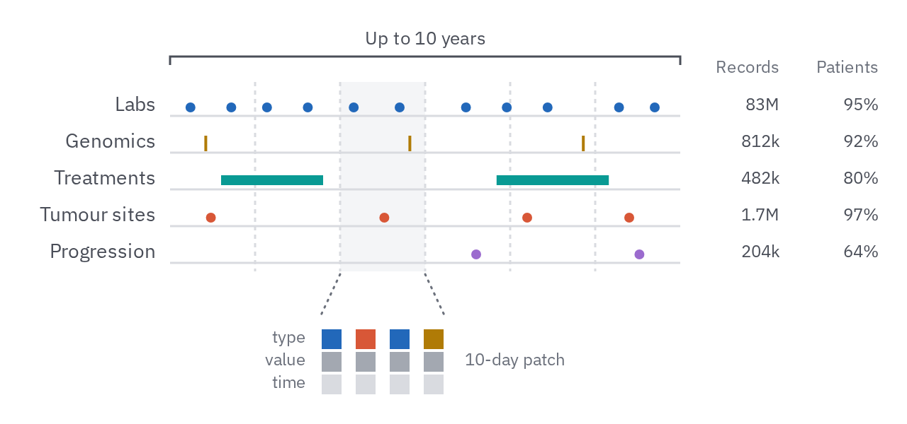

# 29 · Data schematic

For the data a method takes in: which kinds of track, over what extent, how many,
at what resolution, and the unit the model reads (an interval, a patch, a token). It
is a picture of the data's shape, drawn with synthetic marks; the real values go in
the table beside it and in the charts.

- **One row per kind of track on a shared axis**, named at the left in `label`
  (14 px, `ink-2`), each on a 1.5 px `rule` baseline. The mark says the kind: bars
  for coverage, a smooth profile for a broad signal, arcs for links between two
  positions (splice junctions), ticks for single events, dots for measurements,
  intervals for spans (*Glyphs*, `../README.md`). Tracks that are all of one kind are
  `ink-2`; colour is kept for a job (a kind of record, `../../color.md`).
- **Make the profiles look like the data.** Peaks narrow or broad, dense or sparse,
  as the assay gives them, so each row is recognisable before its name is read.
- **The input is on top**: the sequence or the time span as a line, its extent on a
  bracket ("1 Mb", "Up to 10 years"), the axis carrying no ticks.
- **The unit the model reads** cuts the axis with dashed `rule` dividers (`3 3`),
  every other unit in `wash`, with a short `prussian` arrow from the input line into
  each unit.
- **Pairwise data sit under the tracks** as a contact map: the matrix turned 45° so
  each cell lies under the midpoint of its two positions, on the quantity ramp,
  only as many diagonals as the data hold.
- **The table at the right** gives each row its counts (`tick`, right-aligned,
  titled in `muted`) and its resolution in a pill, steps of one ramp from fine to
  coarse. A total sits under a hairline.


```js figure=main w=700 h=380
const S = GA.schematic(ga);
const X = 150, W = 350, P = 4, N = 140, rnd = GA.rng(29);
// synthetic profiles: peaks of a given width and density, plus a little noise
const prof = (k, wid, floor = 0) => {
  const at = Array.from({ length: k }, () => [rnd() * N, 0.35 + 0.65 * rnd()]);
  return Array.from({ length: N }, (_, j) => Math.min(1, Math.max(floor * rnd(), ...at.map(([c, a]) => a * Math.exp(-(((j - c) / wid) ** 2))))));
};
const exons = Array.from({ length: N }, (_, j) => ((j > 18 && j < 46) || (j > 96 && j < 124)) && rnd() < 0.35 ? 0.3 + 0.7 * rnd() : 0);
S.bracket({ x0: X, x1: X + W, y: 44, side: "top", label: "DNA sequence (1 Mb)" });
ga.raw(`<path d="M${X} 56H${X + W}" stroke="var(--ink-2)" stroke-width="1.5"/>`);
for (let k = 0; k < P; k++) S.wire([{ x: X + ((k + 0.5) / P) * W, y: 62 }, { x: X + ((k + 0.5) / P) * W, y: 80 }], { tone: "minor", color: "var(--prussian)" });
const rows = [
  { name: "RNA-seq", kind: "peaks", data: exons },
  { name: "CAGE", kind: "peaks", data: prof(4, 0.6) },
  { name: "DNase", kind: "peaks", data: prof(14, 1.2, 0.08) },
  { name: "ATAC", kind: "peaks", data: prof(10, 1, 0.06) },
  { name: "Histone marks", kind: "signal", data: prof(7, 6, 0.05) },
  { name: "TF binding", kind: "peaks", data: prof(5, 0.8) },
  { name: "Splice junctions", kind: "arcs", data: [[0.14, 0.2], [0.2, 0.31], [0.14, 0.31], [0.7, 0.76], [0.76, 0.86]] },
];
const res = ["1 bp", "1 bp", "1 bp", "1 bp", "128 bp", "128 bp", "1 bp"], step = { "1 bp": 100, "128 bp": 200, "2 kb": 300 };
const T = S.tracks({ x: X, y: 94, w: W, pitch: 26, patches: P, stripes: true, rows, cols: [
  { title: "Human", dx: 50, values: ["640", "520", "300", "170", "1,100", "1,600", "730"] },
  { title: "Mouse", dx: 100, values: ["170", "190", "70", "20", "180", "130", "180"] },
  { title: "Resolution", dx: 170, w: 56, values: res, pill: (i) => tok(`moss-${step[res[i]]}`) },
] });
// pairwise contacts under the tracks
const n = 28, band = 7, cy = T.bottom + 6;
// contacts fall off with distance and stay high inside a domain
const dom = [0, 5, 13, 18, 28], domOf = (i) => dom.findIndex((d, k) => i >= d && i < dom[k + 1]);
const contact = (i, j) => Math.exp(-(j - i) / 2.5) * (domOf(i) === domOf(j) ? 1 : 0.3) * (0.85 + 0.3 * rnd());
const C = S.contact({ x: X, y: cy, w: W, n, band, fill: (i, j) => tok(`teal-${Math.max(1, Math.min(7, Math.round(contact(i, j) * 7)))}00`) });
const mid = cy + (C.bottom - cy) / 2 - 9;
ga.text("Contact map", { x: X - 10, y: mid, anchor: "end", role: "label", size: 14, color: "var(--ink-2)" });
ga.text("30", { x: T.colX({ dx: 50 }), y: mid + 1, anchor: "end", role: "tick", size: 12, color: "var(--ink-2)" });
ga.text("8", { x: T.colX({ dx: 100 }), y: mid + 1, anchor: "end", role: "tick", size: 12, color: "var(--ink-2)" });
ga.pill("2 kb", { cx: T.colX({ dx: 170 }) - 28, cy: mid + 8, w: 56, h: 18, role: "tick", size: 12, fill: tok("moss-300"), color: "var(--ink)" });
// totals under a hairline
const ty = C.bottom + 10;
ga.raw(`<path d="M${T.colX({ dx: 0 }) + 12} ${ty}H${T.colX({ dx: 100 })}" stroke="var(--rule)" stroke-width="1.5"/>`);
ga.text("5,090", { x: T.colX({ dx: 50 }), y: ty + 6, anchor: "end", role: "tick", size: 12, color: "var(--ink)" });
ga.text("948", { x: T.colX({ dx: 100 }), y: ty + 6, anchor: "end", role: "tick", size: 12, color: "var(--ink)" });
```

## Records over time

For records that arrive as events in time (a patient's labs, treatments, sites):
the same layout, with the unit opened into what the model sees.

- Each kind of record takes an identity slot in order (`../../color.md`), and its
  counts sit in the table ("Records", "Patients").
- One unit sits in `wash`. A zoom (`../../illustration.md`, *Zoom*) opens it into its
  items: one column of cells per item, one row per field, named in `tick` at the left.



```js figure=records-over-time w=640 h=300
const S = GA.schematic(ga);
const X = 120, W = 360, P = 6;
// the patch the zoom opens, in wash under the tracks
const u0 = 2 / P, u1 = 3 / P;
ga.raw(`<rect x="${X + u0 * W}" y="58" width="${(u1 - u0) * W}" height="134" fill="var(--wash)"/>`);
const T = S.tracks({ x: X, y: 62, w: W, pitch: 26, patches: P, rows: [
  { name: "Labs", kind: "events", color: "var(--cat-1)", data: [0.04, 0.12, 0.19, 0.27, 0.36, 0.45, 0.58, 0.66, 0.74, 0.88, 0.95] },
  { name: "Genomics", kind: "ticks", color: "var(--cat-2)", data: [0.07, 0.47, 0.81] },
  { name: "Treatments", kind: "spans", color: "var(--cat-3)", data: [[0.1, 0.3], [0.64, 0.86]] },
  { name: "Tumour sites", kind: "events", color: "var(--cat-4)", data: [0.08, 0.42, 0.7, 0.9] },
  { name: "Progression", kind: "events", color: "var(--cat-5)", data: [0.6, 0.92] },
], cols: [
  { title: "Records", dx: 70, values: ["83M", "812k", "482k", "1.7M", "204k"] },
  { title: "Patients", dx: 140, values: ["95%", "92%", "80%", "97%", "64%"] },
] });
S.bracket({ x0: X, x1: X + W, y: 40, side: "top", label: "Up to 10 years" });
// the zoom: the patch opened into its events, in time order
const ev = ["var(--cat-1)", "var(--cat-4)", "var(--cat-1)", "var(--cat-2)"], C = 16, gap = 8;
const zw = ev.length * (C + gap) - gap, zx = X + ((u0 + u1) / 2) * W - zw / 2, zy = 232;
const lead = (x0, x1) => `<path d="M${x0} ${T.bottom + 2}L${x1} ${zy - 8}" stroke="var(--muted)" stroke-width="1.5" stroke-dasharray="1 4" stroke-linecap="round"/>`;
ga.raw(lead(X + u0 * W, zx) + lead(X + u1 * W, zx + zw));
ev.forEach((c, i) => S.cells({ x: zx + i * (C + gap), y: zy, n: 3, cell: C, dir: "v", fill: (j) => [c, "var(--context)", "var(--rule)"][j] }));
["type", "value", "time"].forEach((t, j) => ga.text(t, { x: zx - 10, y: zy + j * C + 1, anchor: "end", role: "tick", size: 12, color: "var(--muted)" }));
ga.text("10-day patch", { x: zx + zw + 14, y: zy + C + 1, role: "tick", size: 12, color: "var(--muted)" });
```

## In each format

| Element | Canvas | Print |
|---|---|---|
| Row pitch, name | 26 px, 14 px | 3 mm, 6–7 pt |
| Event dot / tick / interval | r 3.5 / 2 × 11 px / 7 px tall | r 1 pt / 0.75 pt × 1.2 mm / 0.8 mm |
| Divider | 1.5 px `rule`, `3 3` dash | 0.5 pt, `1 1` dash |
| Coverage bar, profile | row pitch 26 px, peak 16 px | 3 mm pitch, peak 1.8 mm |
| Contact cell | 12–13 px across | 1.2–1.5 mm |
| Resolution pill | 18 px tall, 12 px text | 2 mm, 5–6 pt |
| Field cell | 16 px, 2 px paper gap | 1.6–2 mm, 0.5 pt gap |
