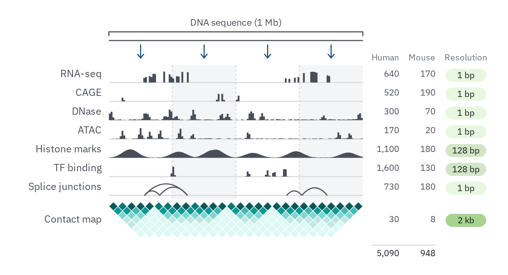

# 29 · Data schematic

For the data a method takes in: which kinds of track, over what extent, how many,
at what resolution, and the unit the model reads (an interval, a patch, a token). It
is a picture of the data's shape, drawn with synthetic marks; the real values go in
the table beside it and in the charts.

- **One row per kind of track on a shared axis**, named at the left in `label`
  (14 px, `ink-2`), each on a 1.5 px `rule` baseline. The mark says the kind: bars
  for coverage, a smooth profile for a broad signal, arcs for links between two
  positions (splice junctions), ticks for single events, dots for measurements,
  intervals for spans (*Glyphs*, `../README.md`). Tracks that are all of one kind are
  `ink-2`; colour is kept for a job (a kind of record, `../../color.md`).
- **Make the profiles look like the data.** Peaks narrow or broad, dense or sparse,
  as the assay gives them, so each row is recognisable before its name is read.
- **The input is on top**: the sequence or the time span as a line, its extent on a
  bracket ("1 Mb", "Up to 10 years"), the axis carrying no ticks.
- **The unit the model reads** cuts the axis with dashed `rule` dividers (`3 3`),
  every other unit in `wash`, with a short `prussian` arrow from the input line into
  each unit.
- **Pairwise data sit under the tracks** as a contact map: the matrix turned 45° so
  each cell lies under the midpoint of its two positions, on the quantity ramp,
  only as many diagonals as the data hold.
- **The table at the right** gives each row its counts (`tick`, right-aligned,
  titled in `muted`) and its resolution in a pill, steps of one ramp from fine to
  coarse. A total sits under a hairline.



```js figure=main w=700 h=380
const S = GA.schematic(ga);
const X = 150, W = 350, P = 4, N = 140, rnd = GA.rng(29);
// synthetic profiles: peaks of a given width and density, plus a little noise
const prof = (k, wid, floor = 0) => {
  const at = Array.from({ length: k }, () => [rnd() * N, 0.35 + 0.65 * rnd()]);
  return Array.from({ length: N }, (_, j) => Math.min(1, Math.max(floor * rnd(), ...at.map(([c, a]) => a * Math.exp(-(((j - c) / wid) ** 2))))));
};
const exons = Array.from({ length: N }, (_, j) => ((j > 18 && j < 46) || (j > 96 && j < 124)) && rnd() < 0.35 ? 0.3 + 0.7 * rnd() : 0);
S.bracket({ x0: X, x1: X + W, y: 44, side: "top", label: "DNA sequence (1 Mb)" });
ga.raw(`<path d="M${X} 56H${X + W}" stroke="var(--ink-2)" stroke-width="1.5"/>`);
for (let k = 0; k < P; k++) S.wire([{ x: X + ((k + 0.5) / P) * W, y: 62 }, { x: X + ((k + 0.5) / P) * W, y: 80 }], { tone: "minor", color: "var(--prussian)" });
const rows = [
  { name: "RNA-seq", kind: "peaks", data: exons },
  { name: "CAGE", kind: "peaks", data: prof(4, 0.6) },
  { name: "DNase", kind: "peaks", data: prof(14, 1.2, 0.08) },
  { name: "ATAC", kind: "peaks", data: prof(10, 1, 0.06) },
  { name: "Histone marks", kind: "signal", data: prof(7, 6, 0.05) },
  { name: "TF binding", kind: "peaks", data: prof(5, 0.8) },
  { name: "Splice junctions", kind: "arcs", data: [[0.14, 0.2], [0.2, 0.31], [0.14, 0.31], [0.7, 0.76], [0.76, 0.86]] },
];
const res = ["1 bp", "1 bp", "1 bp", "1 bp", "128 bp", "128 bp", "1 bp"], step = { "1 bp": 100, "128 bp": 200, "2 kb": 300 };
const T = S.tracks({ x: X, y: 94, w: W, pitch: 26, patches: P, stripes: true, rows, cols: [
  { title: "Human", dx: 50, values: ["640", "520", "300", "170", "1,100", "1,600", "730"] },
  { title: "Mouse", dx: 100, values: ["170", "190", "70", "20", "180", "130", "180"] },
  { title: "Resolution", dx: 170, w: 56, values: res, pill: (i) => tok(`moss-${step[res[i]]}`) },
] });
// pairwise contacts under the tracks
const n = 28, band = 7, cy = T.bottom + 6;
// contacts fall off with distance and stay high inside a domain
const dom = [0, 5, 13, 18, 28], domOf = (i) => dom.findIndex((d, k) => i >= d && i < dom[k + 1]);
const contact = (i, j) => Math.exp(-(j - i) / 2.5) * (domOf(i) === domOf(j) ? 1 : 0.3) * (0.85 + 0.3 * rnd());
const C = S.contact({ x: X, y: cy, w: W, n, band, fill: (i, j) => tok(`teal-${Math.max(1, Math.min(7, Math.round(contact(i, j) * 7)))}00`) });
const mid = cy + (C.bottom - cy) / 2 - 9;
ga.text("Contact map", { x: X - 10, y: mid, anchor: "end", role: "label", size: 14, color: "var(--ink-2)" });
ga.text("30", { x: T.colX({ dx: 50 }), y: mid + 1, anchor: "end", role: "tick", size: 12, color: "var(--ink-2)" });
ga.text("8", { x: T.colX({ dx: 100 }), y: mid + 1, anchor: "end", role: "tick", size: 12, color: "var(--ink-2)" });
ga.pill("2 kb", { cx: T.colX({ dx: 170 }) - 28, cy: mid + 8, w: 56, h: 18, role: "tick", size: 12, fill: tok("moss-300"), color: "var(--ink)" });
// totals under a hairline
const ty = C.bottom + 10;
ga.raw(`<path d="M${T.colX({ dx: 0 }) + 12} ${ty}H${T.colX({ dx: 100 })}" stroke="var(--rule)" stroke-width="1.5"/>`);
ga.text("5,090", { x: T.colX({ dx: 50 }), y: ty + 6, anchor: "end", role: "tick", size: 12, color: "var(--ink)" });
ga.text("948", { x: T.colX({ dx: 100 }), y: ty + 6, anchor: "end", role: "tick", size: 12, color: "var(--ink)" });
```

## Records over time

For records that arrive as events over time (a patient's labs, treatments, findings):
a group of rows per kind of record on one axis from diagnosis, a row per measurement
or category drawn as its data type, and the end of the record marked across every
row, so the reader sees how irregular, sparse and mixed the record is.

- **Rows are grouped by kind of record**, the kind named once at the left in `label`
  at 500, and each row named beside the axis in `tick`. A categorical kind takes
  one compact 16 px row per category, so it reads as categories, not as one track.
- **Each kind keeps its own shape and sampling.** Labs are measured values at
  irregular times, dense around diagnosis and each new line of therapy, joined only
  across short gaps so missing time stays empty; some stop being measured. Each
  value row spans its own range; there is no value axis. An ordinal score snaps to
  its levels and steps between them. Treatments are intervals, one row per drug
  class, overlapping when given together. A genomic finding is a square at its
  test. A tumour site holds once found: a light bar from the first finding to the
  end of the record, a dot at each mention. A binary assessment is a hollow circle
  for no and a filled one for yes.
- **Colour is the kind of record**, identity slots in order (`../../color.md`).
- **What holds for the whole record is an annotation, not a track**: demographics
  at diagnosis are a short mark and a `tick` note at the start of the axis.
- **The end of the record is a vertical line through every row**: solid with an x
  for death, dotted with a hollow circle for censoring (*Glyphs*); the axis beyond it
  stays empty.
- **Records per patch** is one strip under the rows, the 10-day patches the model
  reads on the `slate` ramp, empty patches blank, with no key: darker is more.
- **The table** gives each kind its records and its data type in a `slate-100`
  pill: continuous, ordinal, categorical, multi-category, binary.


```js figure=records-over-time w=722 h=480
const S = GA.schematic(ga);
const X = 210, W = 330, rnd = GA.rng(17), END = 0.86;
// --- a synthetic record (no patient data); times are fractions of ten years
const times = (segs) => segs.flatMap(([a, b, st]) => { const t = []; for (let u = a + st * rnd(); u < b; u += st * (0.6 + 0.8 * rnd())) t.push(u); return t; });
const onTx = (u) => (u > 0.02 && u < 0.18) || (u > 0.55 && u < 0.72);
const clip = (v) => Math.max(0, Math.min(1, v));
const hgbT = times([[0, 0.06, 0.004], [0.06, 0.5, 0.024], [0.5, 0.62, 0.006], [0.62, END, 0.02]]);
const hgb = hgbT.map((u) => [u, clip(0.7 - (onTx(u) ? 0.35 : 0) - (u > 0.74 ? 0.35 * (u - 0.74) / 0.12 : 0) + 0.3 * (rnd() - 0.5))]);
const cre = hgbT.filter((_, i) => i % 2 === 0).map((u) => [u, clip(0.15 + 0.6 * u + (onTx(u) ? 0.2 : 0) + 0.25 * (rnd() - 0.5))]);
const cea = times([[0, 0.05, 0.008], [0.05, 0.42, 0.035]]).map((u) => [u, clip((u < 0.2 ? 0.95 - 3.5 * u : 0.25 + 2.5 * (u - 0.2)) + 0.15 * (rnd() - 0.5))]);
const ecog = [[0.03, 1], [0.1, 1], [0.25, 0], [0.5, 1], [0.56, 2], [0.7, 1], [0.78, 2], [0.84, 3]];
const tx = { Chemotherapy: [[0.02, 0.18], [0.55, 0.72]], Immunotherapy: [[0.02, 0.42], [0.55, 0.64]], Targeted: [[0.76, 0.84]] };
const gen = { KRAS: [0.012], TP53: [0.012, 0.53], STK11: [0.012], KEAP1: [0.53] };
const sites = { Lung: { from: 0, to: END, at: [0, 0.06, 0.3] }, Liver: { from: 0.5, to: END, at: [0.5, 0.56, 0.62, 0.7, 0.84] }, Bone: { from: 0.75, to: END, at: [0.75, 0.8] } };
const prog = [[0.1, 0], [0.2, 0], [0.3, 0], [0.4, 0], [0.48, 1], [0.6, 0], [0.68, 0], [0.74, 1], [0.82, 0]];
// records per 10-day patch, over every row above
const NP = 365, all = [...hgb, ...cre, ...cea, ...ecog, ...prog].map(([u]) => u).concat(Object.values(gen).flat(), Object.values(sites).flatMap((x) => x.at));
const density = Array.from({ length: NP }, (_, j) => {
  const lo = j / NP, hi = (j + 1) / NP;
  return all.filter((u) => u >= lo && u < hi).length + Object.values(tx).flat().filter(([a, b]) => a < hi && b > lo).length;
});
const c = (k) => `var(--cat-${k})`, G = 8;
const rows = [
  { group: "Labs", name: "Haemoglobin", kind: "values", color: c(1), data: hgb, pitch: 24 },
  { group: "Labs", name: "Creatinine", kind: "values", color: c(1), data: cre, pitch: 24 },
  { group: "Labs", name: "CEA", kind: "values", color: c(1), data: cea, pitch: 24, gapAfter: G },
  { group: "Performance", name: "ECOG", kind: "values", levels: 4, gap: 0.2, color: c(2), data: ecog, pitch: 24, gapAfter: G },
  ...Object.entries(tx).map(([k, d], i, a) => ({ group: "Treatments", name: k, kind: "spans", color: c(3), data: d, pitch: 16, gapAfter: i === a.length - 1 ? G : 0 })),
  ...Object.entries(gen).map(([k, d], i, a) => ({ group: "Genomics", name: k, kind: "squares", color: c(4), data: d, pitch: 16, gapAfter: i === a.length - 1 ? G : 0 })),
  ...Object.entries(sites).map(([k, d], i, a) => ({ group: "Tumour sites", name: k, kind: "persist", color: c(5), light: tok("violet-200"), data: d, pitch: 16, gapAfter: i === a.length - 1 ? G : 0 })),
  { group: "Progression", kind: "binary", color: c(6), data: prog, pitch: 24, gapAfter: 16 },
  { name: "Records per patch", kind: "density", data: density, pitch: 20 },
];
const top = 96;
S.bracket({ x0: X, x1: X + W, y: top - 50, side: "top", label: "Up to 10 years from diagnosis" });
// demographics: an annotation at the start of the axis, not a track
ga.raw(`<path d="M${X} ${top - 26}V${top - 4}" stroke="var(--ink-2)" stroke-width="1.5"/>`);
ga.text("At diagnosis: age, sex, cancer type", { x: X + 6, y: top - 29, role: "tick", size: 12, color: "var(--muted)" });
S.tracks({ x: X, y: top, w: W, groupX: 16, groupCols: true, rows, end: { u: END, kind: "death", label: "death" }, cols: [
  { title: "Records", dx: 50, values: ["8.1M", "0.3M", "0.5M", "0.8M", "1.6M", "0.2M", null] },
  { title: "Type", dx: 166, w: 100, values: ["continuous", "ordinal", "multi-category", "multi-category", "multi-category", "binary", null], pill: () => tok("slate-100") },
] });
```

## In each format

| Element | Canvas | Print |
|---|---|---|
| Row pitch, name | 26 px, 14 px | 3 mm, 6–7 pt |
| Event dot / tick / interval | r 3.5 / 2 × 11 px / 7 px tall | r 1 pt / 0.75 pt × 1.2 mm / 0.8 mm |
| Divider | 1.5 px `rule`, `3 3` dash | 0.5 pt, `1 1` dash |
| Coverage bar, profile | row pitch 26 px, peak 16 px | 3 mm pitch, peak 1.8 mm |
| Contact cell | 12–13 px across | 1.2–1.5 mm |
| Resolution or value pill | 18 px tall, 12 px text | 2 mm, 5–6 pt |
| Lab value; category row | r 1.8 dot, 1 px join; 16 px row, 12 px name | r 0.6 pt, 0.35 pt; 1.8 mm row, 5 pt name |
| End of record | 1.5 px line, solid with an x (death) or dotted with a hollow circle (censored) | 0.5 pt |
| Field cell | 16 px, 2 px paper gap | 1.6–2 mm, 0.5 pt gap |
